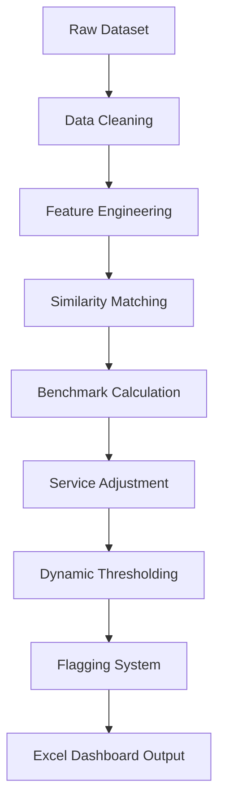

# 🚍✨ FlixBus Pricing Intelligence Engine

### *Turning Raw Transport Data into Strategic Pricing Decisions*

---

## 🌌 Overview

In a highly competitive mobility ecosystem, pricing is not just a number — it's a **strategy**.

This project builds a **Pricing Intelligence Engine** that evaluates whether FlixBus fares are aligned with market dynamics by comparing them against similar competitor buses using **data science, heuristics, and business logic**.

> 💡 Think of it as a **real-time pricing auditor** powered by analytics.

---

## 🎯 Problem Statement

FlixBus operates across thousands of routes where:

* Competitor prices fluctuate constantly
* Demand varies by time, route, and service quality
* Static pricing leads to **revenue leakage** or **customer drop-offs**

👉 The challenge:
**How do we determine if a price is fair, overpriced, or underpriced?**

---

## 🧠 Solution Approach

We engineered a pipeline that:

1. **Understands the market** (competitors)
2. **Finds comparable buses**
3. **Calculates a fair benchmark price**
4. **Flags pricing inefficiencies**
5. **Generates actionable insights**

---

## 🔍 Core Intelligence Modules

### 1. 🧩 Similarity Engine

Not all buses are equal — we compare only *relevant competitors*.

**Matching Logic:**

* 🚌 Bus Type → AC / Sleeper / Seater
* ⏱ Duration → ±60 minutes
* 🕒 Departure Time → ±90 minutes (circular logic)
* ⭐ Ratings → ±0.8

> 🎯 Ensures apples-to-apples comparison

---

### 2. 📊 Smart Benchmarking Engine

We avoid naive averages.

Instead, we compute:

* **Weighted Average Price (WAP)**
* **Occupancy-weighted Median**

💡 Why?
High occupancy = high demand = stronger influence

---

### 3. ⚖️ Dynamic Pricing Validator

Markets behave differently.

| Market Behavior | Threshold |
| --------------- | --------- |
| Stable          | ±10%      |
| Moderate        | ±15%      |
| Volatile        | ±20%      |

Each FlixBus price is evaluated relative to its market volatility.

---

### 4. 🧬 Service Intelligence Layer

Pricing isn't just about distance — it's about **experience**.

We adjust benchmarks based on:

* 📡 Live Tracking
* 🎫 M-Ticket
* 🪑 Seat Layout

**Adjustment Rule:**
`±2% per feature difference`

---

### 5. 🚨 Flagging System

Each trip is classified as:

* ✅ **Fair Price**
* 🔴 **Overpriced**
* 🟡 **Underpriced**

---

## 🔄 End-to-End Workflow



---

## 🛠️ Tech Stack

| Layer                  | Tools                    |
| ---------------------- | ------------------------ |
| 🧪 Data Processing     | pandas, numpy            |
| ⚙️ Logic Engine        | Python                   |
| 📊 Reporting           | openpyxl                 |
| 🧠 Feature Engineering | Regex + Custom Pipelines |

---

## 📦 Output: Excel Intelligence Dashboard

A fully automated **multi-sheet report**:

| Sheet              | Purpose                    |
| ------------------ | -------------------------- |
| 🏠 Cover           | Overview & dataset summary |
| 📊 Summary         | KPIs & aggregated insights |
| 🚨 Flagging Output | Trip-level decisions       |
| 🧠 Logic & Flow    | Methodology                |
| 🗺 Route Insights  | Best & worst routes        |
| 📂 Raw Data        | Processed dataset          |

---

## 📈 Key Metrics Generated

* Total Routes Analyzed
* Total Flix Trips
* Flagged Trip %
* Overpricing vs Underpricing Ratio
* Route-Level Performance

---

## 💡 Insights You Can Extract

✔ Identify routes where FlixBus is consistently overpriced
✔ Detect underpricing → **lost revenue opportunities**
✔ Understand impact of features on pricing power
✔ Benchmark against real competitor demand

---

## ⚡ Performance Highlights

* Handles **800,000+ rows**
* Optimized using:

  * Vectorized operations
  * Smart filtering
  * Bucket-based comparisons

---

## 🔮 Future Scope

* 🤖 ML-based anomaly detection (Isolation Forest, Z-score)
* 📡 Real-time pricing API integration
* 🌐 Interactive dashboard (Streamlit / Next.js)
* ⚡ Parallel processing for scale
* 📊 Graph-based route intelligence

---

## 📁 Project Structure

```
Flix-Pricing-Engine/
│
├── 📂 dataset/
│   └── input files
│
├── 🧠 main.py
│
├── 📊 output/
│   └── pricing_dashboard.xlsx
│
└── 📘 README.md
```

---

## 🎯 Real-World Applications

* 🚍 Transport Companies
* 💰 Revenue Strategy Teams
* 📊 Data Analysts
* 🧠 Pricing Intelligence Platforms

---


> 🚀 Built to answer one simple question:
> **“Is this price right?”**
